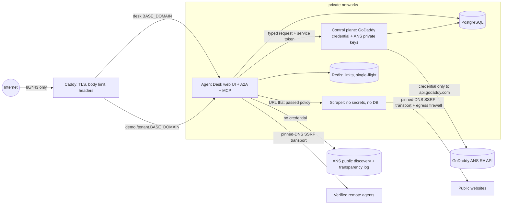

# Agent Desk

**Agent Desk turns controlled websites into verified, discoverable AI agents, then helps other agents discover, verify, and
communicate with them.** Built for the VTHacks 14 GoDaddy *Best Use of ANS* track.

- **CREATE** — an authenticated owner supplies a public website and a subdomain. Agent Desk safely fetches the site, extracts
  business facts into strict structured data, lets the owner confirm them, serves a small **read-only** business agent over
  **A2A and MCP** from one prewritten runtime, and registers it with **GoDaddy ANS**.
- **FIND** — a human or another agent asks for a capability. Agent Desk searches ANS, runs a **15-point verification
  checklist** on each candidate (live lifecycle, host/endpoint binding, outbound network policy, TLS, transparency log,
  identity certificate, A2A card, MCP handshake, drift, blocklist) and only then relays a read-only question. The reply is
  always treated as untrusted data.

> Live gate status is tracked in [`GATES.md`](GATES.md). Nothing in this repository claims a live gate that was not observed.

## Architecture



One image, four roles (`SERVICE_ROLE`): `desk`/`runtime` (public), `controlplane` (private, holds the PAT and keys),
`scraper` (private, secret-less), `all` (development). One **generic runtime** serves Agent Desk and every tenant, selected
by the validated `Host` header → database row. No code is ever generated from website content.

| Path | Purpose |
|---|---|
| `/.well-known/agent-card.json` (+ legacy `/.well-known/agent.json`) | A2A Agent Card, per host, generated from trusted config |
| `/a2a` | A2A JSON-RPC (A2A 1.0 `SendMessage`; SDK 0.3 compatibility for `message/send`) |
| `/mcp` | MCP Streamable HTTP (stateless JSON), read-only tools |
| `/.well-known/mcp.json` | MCP discovery metadata (used as ANS `metaDataUrl`) |
| `/proof`, `/api/proof` | Live five-gate + 15-check evidence for the requested host, redacted |
| `/`, `/create`, `/find`, `/security`, `/login` | Server-rendered UI (desk host only; tenant hosts serve an agent landing page) |
| `/healthz` | Liveness only |

**Exact protocol URLs** (replace `BASE_DOMAIN`): Agent Desk `https://desk.BASE_DOMAIN/a2a`, `https://desk.BASE_DOMAIN/mcp`;
demo business agent `https://demo.BASE_DOMAIN/a2a`, `https://demo.BASE_DOMAIN/mcp`; tenants `https://<label>.BASE_DOMAIN/…`.

Agent Desk skills/tools: `find_agent(query)`, `verify_agent(agent_host)`, `about_agent_desk()`.
Business agent skills/tools: `get_business_info(question)`, `get_hours()`, `get_menu_or_services()`. All read-only.
Payment/booking/purchase requests are unsupported and fail closed.

### SDK versions this build was implemented and tested against

| Package | Version | Notes |
|---|---|---|
| Python | 3.12 | |
| `a2a-sdk[http-server]` | 1.1.4 | protobuf-based `AgentCard`, `create_jsonrpc_routes(enable_v0_3_compat=True)`, `DefaultRequestHandler` |
| `mcp` | 2.2.0 | `MCPServer` (FastMCP successor), `streamable_http_app(stateless_http=True, json_response=True)` |
| FastAPI / Starlette | 0.141.1 / 1.6.0 | |
| httpx / httpcore | 0.28.1 | pinned-DNS transport (`app/security/ssrf.py`) |
| cryptography | 50.0.1 | keys, CSRs, `x509.verification` chain building |
| SQLAlchemy / Alembic | 2.0.54 | |

Exact pins are in `uv.lock`. The outbound A2A/MCP **clients are hand-written** on the pinned SSRF transport: the MCP 2.x SDK
client uses a different HTTP stack that cannot take our transport, and size/time caps must apply to every byte.

## CREATE flow

1. Owner signs in (Argon2id, opaque `__Host-` session, CSRF token + Origin/Fetch-Metadata).
2. `POST /admin/tenants` — subdomain is validated as a sanitized direct child of `BASE_DOMAIN` (reserved labels refused).
3. **Safe fetch** (`app/ingestion/safe_fetch.py`): https/443 only, no IP literals/userinfo, DNS resolved by us, every answer must be
   globally routable, the validated address is the one connected to, ≤3 re-validated redirects, html/plain only,
   2 MiB/page, 10 MiB/import, 10 pages, depth 2, 60 s. Runs in the secret-less scraper service in production.
4. **Static extraction**: scripts/styles/iframes/forms/comments/hidden nodes removed; JSON-LD parsed as data.
5. **Quarantined extraction model** (or deterministic heuristic with `LLM_PROVIDER=none`): no tools, no network, no secrets;
   output must parse as `ExtractionOutput` (`extra='forbid'`, bounded, capability enum). Max 2 attempts, then heuristic draft.
6. Owner **reviews, edits and explicitly confirms**. Only then is an immutable `AgentConfig` version published.
7. ANS registration from the tenant page (or `deploy/ans_register.py`): keys + CSRs → `POST /v1/agents/register` →
   DNS-01 TXT → `verify-acme` → ANS DNS records → `verify-dns` → **ACTIVE** (status only ever copied from GoDaddy).

## FIND flow

1. Query → enum intent tags + bounded keywords (deterministic; cannot name URLs, hosts or tools).
2. `POST /v1/ans/search-registered-agents` (public API, **no credential sent**), `ACTIVE` only; or the exact-FQDN path.
3. Up to 3 candidates are verified (checklist below). Any FAIL → not contacted. Trust score is informational only.
4. One read-only question over the verified, ANS-registered endpoint (A2A preferred, MCP read-only tools otherwise).
   No caller token can be forwarded (the clients have no parameter for one). No chaining: a reply never causes another call.
5. Reply shown as **untrusted text**, with the verification summary and an audit trail.

### The 15 checks

`ans_status_active` · `canonical_agent_host` · `supported_protocol` · `endpoints_https` (+ real TLS handshake) ·
`endpoint_host_binding` · `endpoint_network_policy` · `ans_record_consistency` (search ↔ detail ↔ transparency-log badge) ·
`identity_certificate_retrieved` · `identity_certificate_binding` (validity, host, `ans://` URI SAN, TL fingerprint) ·
`identity_chain_trust_anchor` · `metadata_fetch` · `metadata_schema` · `metadata_integrity` · `card_hash_drift` · `local_blocklist`.

Each is `PASS` / `FAIL` / `INCOMPLETE`. Any FAIL ⇒ decision FAIL. A mandatory INCOMPLETE ⇒ decision INCOMPLETE.
The identity-certificate checks are optional-but-blocking-on-FAIL. **GoDaddy publishes no ANS root CA bundle**
(`docs/research/ANS_API_NOTES.md` §8), so the anchor is provisioned once by an operator from the only non-agent
source there is — the `chainPEM` of an agent you own, fetched from the authenticated certificate API:

```bash
uv run python deploy/ans_trust_anchor.py --host desk.example.com     # prints the anchor + its SHA-256 pin
```

Set `ANS_TRUST_ANCHOR_PATH` and `ANS_TRUST_ANCHOR_SHA256` from its output. Until you do,
`identity_chain_trust_anchor` reports **INCOMPLETE** — never PASS. A root that merely arrives in a remote
agent's chain is still ignored, and if the bundle is ever swapped the pin sends the check back to INCOMPLETE.

The certificate API only serves agents your credential owns, so checks 8–10 stay INCOMPLETE for third-party
agents. That is the honest answer, not a defect.

## Local development

```bash
pip install uv            # or: curl -LsSf https://astral.sh/uv/install.sh | sh
uv sync                   # creates .venv from uv.lock
uv run pytest             # 470+ tests, no network needed
uv run python scripts/security_self_test.py

# run it (SQLite, in-process limiter, deterministic answers)
export ENV=development BASE_DOMAIN=agentdesk.local PUBLIC_SCHEME=http PUBLIC_PORT=8000 HSTS_ENABLED=false
OWNER_EMAIL=you@example.com uv run python -m app.cli create-owner        # prompts for a password (≥12 chars)
uv run uvicorn --factory app.main:app_factory --host 127.0.0.1 --port 8000
# add to /etc/hosts:  127.0.0.1 desk.agentdesk.local demo.agentdesk.local
curl -H 'Host: demo.agentdesk.local' http://127.0.0.1:8000/.well-known/agent-card.json
```

Note: session cookies are `Secure` + `__Host-`, so browser login needs HTTPS (use the compose stack or a local TLS proxy).
Protocol endpoints, `/find` and `/proof` work over plain HTTP locally.

## Production deployment (single VPS)

Prerequisites you provide (see `GATES.md`): an MLH domain you own, a public Linux host, DNS `A` records for
`desk.`/`demo.` (and `*.` for tenants) → that host, a production GoDaddy credential.

```bash
# 1. host
sudo SSH_SOURCE=<your-ip>/32 ./deploy/firewall.sh            # 22/80/443 only + scraper/control-plane egress rules (--dry-run to preview)

# 2. secrets (outside git; chmod 600)
python scripts/generate_keys.py secrets                      # prints random values once, to your terminal only
mkdir -p secrets && chmod 700 secrets
#   secrets/postgres.env      POSTGRES_USER, POSTGRES_PASSWORD, POSTGRES_DB=agentdesk, APP_DB_PASSWORD,
#                             DATABASE_URL=postgresql+asyncpg://<owner>:<pw>@postgres:5432/agentdesk   (migrations only)
#   secrets/desk.env          SESSION_SECRET, CSRF_SECRET, CONTROLPLANE_TOKEN, REDIS_URL=redis://redis:6379/0,
#                             DATABASE_URL=postgresql+asyncpg://agentdesk_app:<APP_DB_PASSWORD>@postgres:5432/agentdesk
#   secrets/controlplane.env  GODADDY_PAT (or ANS_AUTH_SCHEME=sso-key + GODADDY_API_KEY/SECRET), CONTROLPLANE_TOKEN,
#                             SESSION_SECRET, CSRF_SECRET (unused placeholders ≥32 chars), DATABASE_URL (app role)

# 3. start
export BASE_DOMAIN=<your-mlh-domain> ACME_EMAIL=<you@…>
docker compose -f deploy/docker-compose.yml config -q && docker compose -f deploy/docker-compose.yml up -d --build
docker compose -f deploy/docker-compose.yml exec -e OWNER_EMAIL=<you@…> desk python -m app.cli create-owner

# 4. verify Gates 1–3 from ANOTHER machine
python scripts/verify_public.py --host desk.$BASE_DOMAIN --host demo.$BASE_DOMAIN
```

`caddy validate --config deploy/Caddyfile` and `docker compose … config -q` validate the two config files (neither tool
was available on the build machine; the compose file was structurally checked with a YAML parser only).

## ANS registration flow (Gate 4)

Run inside the **control plane** container (the only place with the credential and the keys):

```bash
CP="docker compose -f deploy/docker-compose.yml exec controlplane python deploy/ans_register.py"
$CP --host desk.$BASE_DOMAIN                  # checks public A2A/MCP/TLS, reports gddy status, generates keys+CSRs, registers,
                                               # prints the exact _acme-challenge TXT record          → exit 3 (action required)
#   … publish the TXT record at your DNS host (or add --gddy-dns --zone <zone> for a confirmed `gddy dns add`) …
$CP --host desk.$BASE_DOMAIN --verify         # POST verify-acme, poll to PENDING_DNS, print the ANS DNS records
#   … publish _ans / _ans-badge TXT (+ TLSA/HTTPS where your DNS host supports them) …
$CP --host desk.$BASE_DOMAIN --verify-dns     # POST verify-dns, poll to ACTIVE, fetch public certs, write redacted evidence
$CP --host desk.$BASE_DOMAIN --status         # live status only
```

`gddy` (GoDaddy CLI): install with `curl -fsSL https://github.com/godaddy/cli/releases/latest/download/install.sh | bash`,
then `gddy --help`, `gddy tree`, `gddy search ans`, `gddy api --help`, `gddy auth status`, `gddy env get`. As researched on
2026-09-19 gddy has **no ANS commands**; it is used here for auth/env inspection and (optionally) exact TXT records via
`gddy dns add`. Auth scheme conflict (PAT Bearer vs `sso-key`) is handled by `ANS_AUTH_SCHEME`. If event instructions
differ from the public docs, the event instructions win.

### How to verify ACTIVE (three independent ways)

```bash
curl -s https://api.godaddy.com/v1/ans/registered-agents/<agentId> | jq '.lifecycle.status'     # public, no auth
curl -s https://transparency.ans.godaddy.com/v1/agents/<agentId> | jq '.status'                  # transparency log badge
open https://desk.$BASE_DOMAIN/proof                                                             # Gate 4 turns PASS only from a live lookup
```

## Evidence bundle (Gate 5)

```bash
python scripts/evidence_bundle.py --host desk.$BASE_DOMAIN --host demo.$BASE_DOMAIN   # → artifacts/evidence-<host>-<ts>.json
python scripts/security_self_test.py --host desk.$BASE_DOMAIN                         # §40 summary + live ANS evidence
```

Bundles are produced from live checks and scanned before writing: private-key PEM, PAT/bearer shapes or any configured
secret value abort the export.

## Five-gate proof checklist

| Gate | Requirement | Where it is shown | Command |
|---|---|---|---|
| 1 | Reachable A2A + MCP for Agent Desk and a business agent | `/proof` Gate 1, Agent Card, MCP handshake + tool probe | `scripts/verify_public.py` |
| 2 | Public HTTPS | `/proof` Gate 2: TLS version, hostname check, leaf fingerprint, expiry | `scripts/verify_public.py` |
| 3 | Owned MLH domain | `/proof` Gate 3 (PASS only when ANS validated DNS control for a host under `BASE_DOMAIN`) | DNS + ANS |
| 4 | Production credential + CLI flow → ACTIVE | `/proof` Gate 4: agentId, ANS name, ACTIVE, production, checked_at | `deploy/ans_register.py` |
| 5 | Verification evidence | `/proof`, `/api/proof`, evidence bundle | `scripts/evidence_bundle.py` |

## Three-minute demo script

1. **Home** `https://desk.BASE_DOMAIN/` — two cards, “discover → verify → communicate”.
2. **Proof** `/proof` — five gates with live timestamps; open `/api/proof`; show `demo.BASE_DOMAIN/proof` too.
3. **Create** — sign in, import a small public site, show the DRAFT preview (hidden/injected text absent), confirm, publish;
   `curl https://<label>.BASE_DOMAIN/.well-known/agent-card.json`; show the ANS panel (status mirrored from GoDaddy).
4. **Find** — “coffee shop opening hours”, or exact host `demo.BASE_DOMAIN`, question “When are you open on Saturday?” →
   15 checks → untrusted reply. Then try `agent.webmesh.ai` as exact host (third-party interop).
5. **Attack it** — Find with exact host `169.254.169.254` / `localhost` (refused before any request); ask the demo agent over
   A2A to “book a table and pay” (fails closed); `curl -H 'Host: evil.com'` (400); `python scripts/security_self_test.py`.

## Environment variables

See [`.env.example`](.env.example) — every variable is documented there. Production start-up **refuses** unsafe
configuration (placeholder secrets, SQLite, no Redis, `DEBUG`, non-https origin, placeholder domain).

## Repository layout

```
app/security/   SSRF policy + pinned transport, sessions, CSRF, headers, rate limits, idempotency, tokens, audit, redaction
app/protocols/  a2a_server, mcp_server, a2a_client, mcp_client, remote_http
app/agents/     registry (Host→tenant), runtime (skills), knowledge (deterministic answers), llm (unprivileged adapter), seed
app/ans/        certs (keys/CSRs/chain), client (REST), registration (state machine), verifier (15 checks), evidence (proof)
app/ingestion/  safe_fetch, html_extract, extraction_model, scraper_service, policy
app/find/       intent, service          app/controlplane/  tenants (owner-scoped lifecycle), api (private ANS RPC)
app/web/        routes (public), admin (owner), templates/, static/        app/main.py  assembly + roles
deploy/         Caddyfile, docker-compose.yml, firewall.sh, postgres-init.sh, ans_register.py
scripts/        generate_keys.py, verify_public.py, evidence_bundle.py, security_self_test.py
docs/           spec, build prompt, research notes (ANS API contract incl. live addendum, Webmesh interop)
```

## Known limitations

- Identity-certificate chain verification is INCOMPLETE until an operator provisions the anchor
  (`deploy/ans_trust_anchor.py`); no bundle is published by GoDaddy. Transparency-log badges are fetched over TLS from
  the official host and compared, but their signatures/Merkle proofs are not verified offline yet.
- Agent Card integrity: ANS `metaDataHash` is verified when present, but the registry does not populate it today
  (confirmed live on the detail, search and transparency-log APIs). A card signed with a key the agent publishes for
  itself is recorded and reported INCOMPLETE — it adds no trust beyond TLS. A card signed with the key in the
  **ANS-issued identity certificate** is verified and PASSes, because that key is bound to `ans://v{version}.{host}`
  by the registry's own CA. Agent Desk signs its own cards that way (`app/ans/card_signature.py`); third-party agents
  that do not remain INCOMPLETE.
- The deterministic (no-LLM) extractor is conservative: it fills name, description, contact, address and hours; menus/services
  usually need the owner to type them or an LLM provider to be configured.
- A2A tasks are in-memory and complete immediately; streaming and push notifications are intentionally disabled.
- MFA is not implemented (`mfa_state` column reserved). Public sign-up is disabled.
- `deploy/Caddyfile` and `deploy/docker-compose.yml` were not executed on the build machine (no Docker/Caddy there).
- No payment, booking or spending authority exists; AP2/x402 attack-battery cases are documented as not applicable in
  [`SECURITY.md`](SECURITY.md) rather than claimed as passed.
